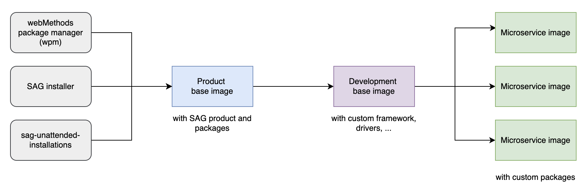

#   Build of the MSR base image

TO BE REWRITTEN!!!


To factorize the complexity and ensure your product (or project) teams use container images with products that are compliant with your standards and correctly patched, you should consider creating certified and reusable base images.



Usually, base images and (end product) microservice images follow different lifecycles. Microservice images are meant to change often, whereas base images are far more stable. You would only change your base images on a monthly basis at most, except of course if a critical patch needs to be applied.  

This article describes a two-steps process to build base images, but some may choose to do it in a one-step process.  

##  Creation of product base images

There are several methods to build a base image:
-   using the product images provided at https://containers.softwareag.com, combined with the packages registry https://packages.softwareag.com and the webMethods Package Manager (wpm)
-   using the SAG installer
-   using sag-unattended-installations (https://github.com/SoftwareAG/sag-unattended-installations)

###  Using the webMethods package manager

Gradually, the webMethods packages will be made available in https://packages.softwareag.com, which is webMethods's equivalent to https://www.npmjs.com (for Node.js) or Maven central (for Java.)

If the packages you need for your microservice are available in https://packages.softwareag.com, then you should use this methods to build your base image, which is the one officially recommended by SAG.

There are a few prerequisites:
-   You need to get your docker login credentials from https://containers.softwareag.com
-   You then need to use these credentials to login in your favorite shell: `docker login -u ${USER_NAME} -p ${PASSWORD} sagcr.azurecr.io`
-   You also need to get a wpm token from https://packages.softwareag.com
You can login to both https://containers.softwareag.com and https://packages.softwareag.com using your Empower credentials.


Once you've done your docker login and you've retrieved your wpm token, you can use the following Dockerfile to build your base image:
```
# Build using an explicit product image version. New versions are published on a monthly basis.
FROM sagcr.azurecr.io/webmethods-microservicesruntime:10.15

# Install the wpm tool. With webMethods 11, wpm will automatically be included and this step will no longer be needed
ADD --chown=sagadmin:sagadmin wpm /opt/softwareag/wpm
RUN chmod u+x /opt/softwareag/wpm/bin/wpm.sh
ENV PATH=/opt/softwareag/wpm/bin:$PATH

# Store the wpm token in an environment variable, so that we can use it in the subsequent steps
ARG WPM_TOKEN

# install the WmJDBCAdapter package using wpm - this is where the wpm token is used
WORKDIR /opt/softwareag/wpm
RUN /opt/softwareag/wpm/bin/wpm.sh install -ws https://packages.softwareag.com -wr softwareag -j $WPM_TOKEN -d /opt/softwareag/IntegrationServer WmJDBCAdapter
WORKDIR /
```  

To perform the build, use the following command
```
docker build --build-arg WPM_TOKEN=<your-wpm-token> -t <your-image-name> .
```

Important note: the value of $WPM_TOKEN will be visible using the `docker inspect <image-name>` command. There are ways of protecting it, using a staged build or using a Docker build secret, but I have decided to keep things simple - and more readable here.

###  Using the SAG Installer

Since webMethods v10.11, the SAG installer embeds a feature to generate Docker images for some of the products. This is documented here: https://documentation.softwareag.com/a_installer_and_update_manager/wir10-15/webhelp/wir-webhelp/index.html#page/wir-webhelp%2Fto-console_mode_27.html%23  

You will have to follow this method to build your base image if you need packages that aren't available in https://packages.softwareag.com yet.  
This build process only works in Linux environments, and you need a working Docker engine in this environment.    
In the commands provided below, installer.bin is the Linux based SAG installer downloaded from Empower, and renamed into installer.bin.  

First, you need to find the codes of the products you need to install:
```
sh installer.bin list artifacts --release 10.15 --username $EMPOWER_USERNAME --password $EMPOWER_PASSWORD --platform LNXAMD64
```

A few important product codes:
- MSC: the MSR core base
- PIEContainerExternalRDBMS: support of relational databases
- jdbcAdapter: JDBC adapter
- wst: Cloudstreams server
- Monitor: wM Monitor

Then, once you've got your list of product codes, you can build your image.  
For instance you can use this command to build a base image named wm-msr:10.15 with the MSR core base, RDBMS support, JDBC adapter, CloudStreams server and WmMonitor:
```
sh installer.bin create container-image --name wm-msr:10.15 --release 10.15 --accept-license --products MSC,Monitor,PIEContainerExternalRDBMS,wst,jdbcAdapter --admin-password manage --username $EMPOWER_USERNAME --password $EMPOWER_PASSWORD
```

Since the process needs to download binaries from Empower, it takes a few minutes.  
When it ends, you can check if your base image has correctly been generated using `docker images`.  

###  Using sag-unattended-installations

This method is supported by PS and is a little more advanced.  
Behind the scenes, it also uses the SAG Installer, but it gives you more control on the content of the image.  
If you need images that have an advanced level of optimization, then you should consider using it.  

It is documented here: https://github.com/SoftwareAG/sag-unattended-installations

##  Creating a development base image

To obtain a development base image you need to add:
- the drivers and libraries needed by the SAG packages: for instance the JDBC driver or the libraries needed by the SAP adapter
- your custom framework: packages, jar files, possibly some configuration elements as well

As a rule of thumb, everything that is common to all microservices, has a high potential of reusability and is stable should be included here.

The following is an example Dockerfile that adds a JDBC driver and a framework package to the product base image:
```
FROM <product-base-image-name>

# Install the wpm tool. With webMethods 11, wpm will automatically be included and this step will no longer be needed
# if you used wpm to create your product base image, then wpm is also part of this image and this layer is also not needed
ADD --chown=sagadmin:sagadmin wpm /opt/softwareag/wpm
RUN chmod u+x /opt/softwareag/wpm/bin/wpm.sh
ENV PATH=/opt/softwareag/wpm/bin:$PATH

# wpm needs a Github token to fetch the framework package in Github, we receive it as a build argument
ARG GIT_TOKEN

# We add our framework, using the webMethods package manager (wpm) 
RUN /opt/softwareag/wpm/bin/wpm.sh install -u staillansag -p $GIT_TOKEN -r https://github.com/staillansag -d /opt/softwareag/IntegrationServer qdtFramework

# Download the Postgres JDBC driver and place it in the WmJDBCAdapter/code/jars folder
WORKDIR /opt/softwareag/IntegrationServer/packages/WmJDBCAdapter/code/jars
RUN curl -O https://jdbc.postgresql.org/download/postgresql-42.7.1.jar
WORKDIR /
```

Important note: the value of $GIT_TOKEN will be visible using the `docker inspect <image-name>` command. There are ways of protecting it, using a staged build or using a Docker build secret, but I have decided to keep things simple - and more readable here.